# Дипломный практикум в Yandex.Cloud Барсуков А.А.
  * [Цели:](#цели)
  * [Этапы выполнения:](#этапы-выполнения)
     * [Создание облачной инфраструктуры](#создание-облачной-инфраструктуры)
     * [Создание Kubernetes кластера](#создание-kubernetes-кластера)
     * [Создание тестового приложения](#создание-тестового-приложения)
     * [Подготовка cистемы мониторинга и деплой приложения](#подготовка-cистемы-мониторинга-и-деплой-приложения)
     * [Установка и настройка CI/CD](#установка-и-настройка-cicd)
  * [Что необходимо для сдачи задания?](#что-необходимо-для-сдачи-задания)
  * [Как правильно задавать вопросы дипломному руководителю?](#как-правильно-задавать-вопросы-дипломному-руководителю)

**Перед началом работы над дипломным заданием изучите [Инструкция по экономии облачных ресурсов](https://github.com/netology-code/devops-materials/blob/master/cloudwork.MD).**

---
## Цели:

1. Подготовить облачную инфраструктуру на базе облачного провайдера Яндекс.Облако.
2. Запустить и сконфигурировать Kubernetes кластер.
3. Установить и настроить систему мониторинга.
4. Настроить и автоматизировать сборку тестового приложения с использованием Docker-контейнеров.
5. Настроить CI для автоматической сборки и тестирования.
6. Настроить CD для автоматического развёртывания приложения.

---
## Этапы выполнения:


### Создание облачной инфраструктуры

Для начала необходимо подготовить облачную инфраструктуру в ЯО при помощи [Terraform](https://www.terraform.io/).

Особенности выполнения:

- Бюджет купона ограничен, что следует иметь в виду при проектировании инфраструктуры и использовании ресурсов;
Для облачного k8s используйте региональный мастер(неотказоустойчивый). Для self-hosted k8s минимизируйте ресурсы ВМ и долю ЦПУ. В обоих вариантах используйте прерываемые ВМ для worker nodes.

Предварительная подготовка к установке и запуску Kubernetes кластера.

1. Создайте сервисный аккаунт, который будет в дальнейшем использоваться Terraform для работы с инфраструктурой с необходимыми и достаточными правами. Не стоит использовать права суперпользователя
2. Подготовьте [backend](https://developer.hashicorp.com/terraform/language/backend) для Terraform:  
   а. Рекомендуемый вариант: S3 bucket в созданном ЯО аккаунте(создание бакета через TF)
   б. Альтернативный вариант:  [Terraform Cloud](https://app.terraform.io/)
3. Создайте конфигурацию Terrafrom, используя созданный бакет ранее как бекенд для хранения стейт файла. Конфигурации Terraform для создания сервисного аккаунта и бакета и основной инфраструктуры следует сохранить в разных папках.
4. Создайте VPC с подсетями в разных зонах доступности.
5. Убедитесь, что теперь вы можете выполнить команды `terraform destroy` и `terraform apply` без дополнительных ручных действий.
6. В случае использования [Terraform Cloud](https://app.terraform.io/) в качестве [backend](https://developer.hashicorp.com/terraform/language/backend) убедитесь, что применение изменений успешно проходит, используя web-интерфейс Terraform cloud.

Ожидаемые результаты:

1. Terraform сконфигурирован и создание инфраструктуры посредством Terraform возможно без дополнительных ручных действий, стейт основной конфигурации сохраняется в бакете или Terraform Cloud
2. Полученная конфигурация инфраструктуры является предварительной, поэтому в ходе дальнейшего выполнения задания возможны изменения.

---

### Решение. Создание облачной инфраструктуры  
1. Создаем сервисный аккаунт [service-account-terraform.tf](./terraform/service-account-S3/service-account-terraform.tf) с правами `editor`. 
2. Подготавливаем S3 [bucket](./terraform/service-account-S3/bucket.tf) в созданном Яндекс Облаке аккаунте(создание бакета через terraform). - Создаем директорию `backend`.
  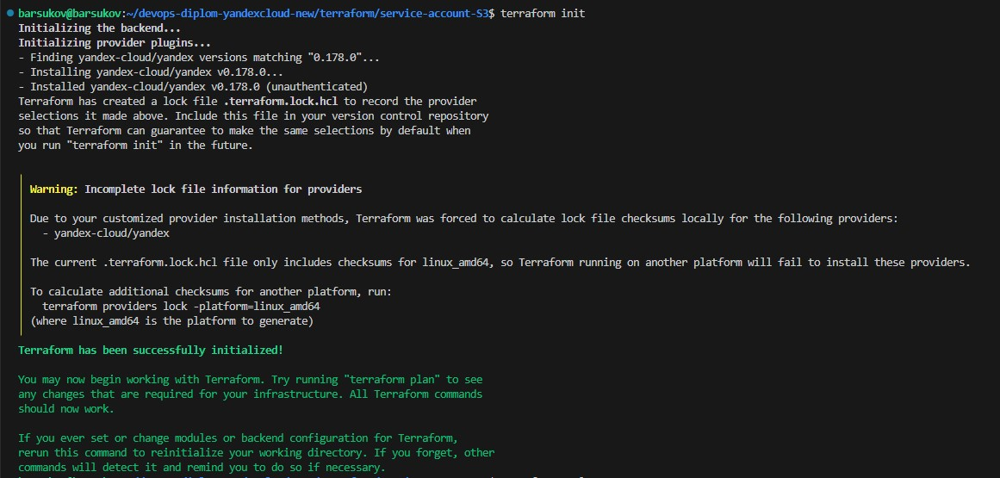 
  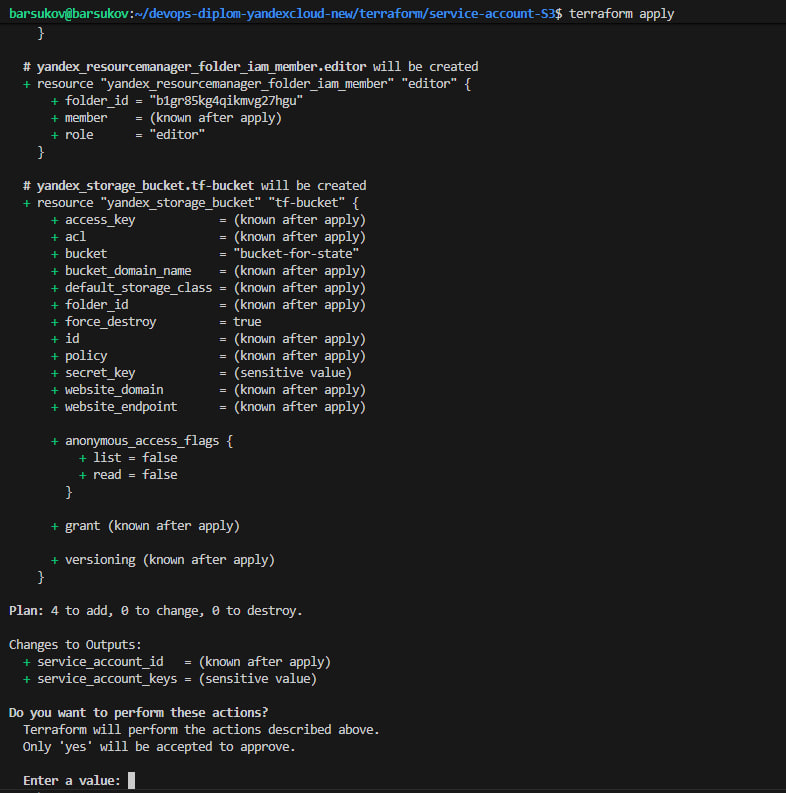 
 Сохраняем ключи ACCESS_KEY и SECRET_KEY в файл `backend/backend.tfvars` для дальнейшего использования. 

3. Создаем [конфигурацию](./terraform/backend/backend.tf) Terrafrom для использования ранее созданного бакета как бекенд для хранения стейт файла.  
   
     Выполняем команды из директории `backend`:
     ``` bash  
     source backend.tfvars  
     terraform init -backend-config="access_key=$ACCESS_KEY" -backend-config="secret_key=$SECRET_KEY"  
     ```
4. Создаем VPC с подсетями в разных зонах доступности.  
   Будем использовать одну Master ноду и две Worker ноды.  
   После успешного выполнения команды `terraform apply` в директории `backend` проверяем созданную инфраструктуру.  
   - Сервисный аккаунт:  
  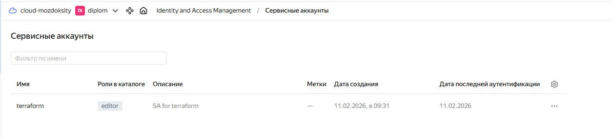    
  - S3-bucket c файлом настройки :  
    
  - Сеть и подсети:  
  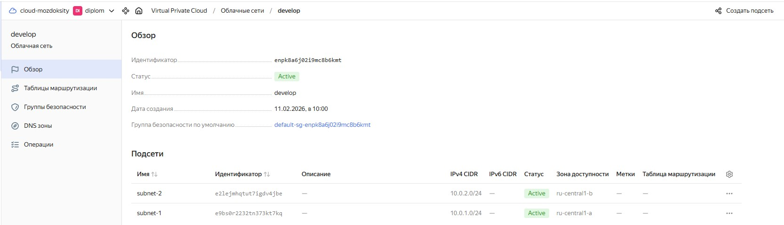  
  - Виртуальные машины в разных подсетях и зонах доступности:  
  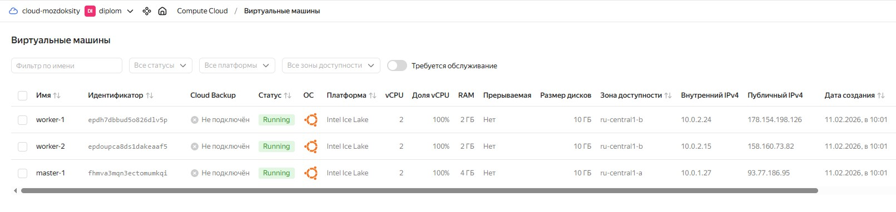 
5. Выполняем команду  `terraform destroy`:  
  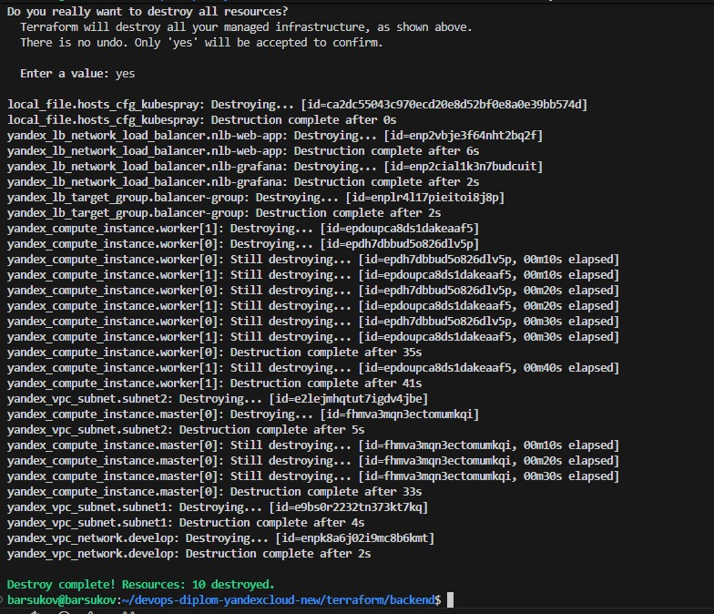 
  Код выполняется без дополнительных ручных действий.  


### Создание Kubernetes кластера

На этом этапе необходимо создать [Kubernetes](https://kubernetes.io/ru/docs/concepts/overview/what-is-kubernetes/) кластер на базе предварительно созданной инфраструктуры.   Требуется обеспечить доступ к ресурсам из Интернета.

Это можно сделать двумя способами:

1. Рекомендуемый вариант: самостоятельная установка Kubernetes кластера.  
   а. При помощи Terraform подготовить как минимум 3 виртуальных машины Compute Cloud для создания Kubernetes-кластера. Тип виртуальной машины следует выбрать самостоятельно с учётом требовании к производительности и стоимости. Если в дальнейшем поймете, что необходимо сменить тип инстанса, используйте Terraform для внесения изменений.  
   б. Подготовить [ansible](https://www.ansible.com/) конфигурации, можно воспользоваться, например [Kubespray](https://kubernetes.io/docs/setup/production-environment/tools/kubespray/)  
   в. Задеплоить Kubernetes на подготовленные ранее инстансы, в случае нехватки каких-либо ресурсов вы всегда можете создать их при помощи Terraform.
2. Альтернативный вариант: воспользуйтесь сервисом [Yandex Managed Service for Kubernetes](https://cloud.yandex.ru/services/managed-kubernetes)  
  а. С помощью terraform resource для [kubernetes](https://registry.terraform.io/providers/yandex-cloud/yandex/latest/docs/resources/kubernetes_cluster) создать **региональный** мастер kubernetes с размещением нод в разных 3 подсетях      
  б. С помощью terraform resource для [kubernetes node group](https://registry.terraform.io/providers/yandex-cloud/yandex/latest/docs/resources/kubernetes_node_group)
  
Ожидаемый результат:

1. Работоспособный Kubernetes кластер.
2. В файле `~/.kube/config` находятся данные для доступа к кластеру.
3. Команда `kubectl get pods --all-namespaces` отрабатывает без ошибок.

---

### Решение. Создание Kubernetes кластера 

Разворачиваем Kubernetes кластер из репозитория Kubespray.  
Для этого клонируем репозиторий на свою рабочую машину:  
 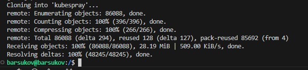 

При создании облачной инфраструктуры с помощью terraform, мы создали inventory-файл `hosts.yaml` с помощью кода в файле [ansible.tf](./terraform/backend/ansible.tf):
```bash
resource "local_file" "hosts_cfg_kubespray" {
  content  = templatefile("${path.module}/hosts.tftpl", {
    workers = yandex_compute_instance.worker
    masters = yandex_compute_instance.master
  })
  filename = "../../../kubespray/inventory/mycluster/hosts.yaml"
  
  depends_on = [
    yandex_compute_instance.master,
    yandex_compute_instance.worker
  ]
}
```  
Который по [шаблону](./terraform/backend/hosts.tftpl) автоматически заполнит inventory-файл ip адресами нод.  


Переходим на своем рабочем ПК в директорию `/kubespray` и выполняем команды:  

```bash  
python3 -m venv .venv
source .venv/bin/activate
pip install -r requirements.txt
```  


После установки зависимостей, с помощью `ansible` (выполнять команду при активированном виртуальном окружении `source .venv/bin/activate` из директории `kubespray/`):  
   
```bash  
ansible-playbook -i inventory/mycluster/hosts.yaml -u user --become --become-user=root --private-key=~/.ssh/id_rsa -e 'ansible_ssh_common_args="-o StrictHostKeyChecking=no"' cluster.yml --flush-cache  
```  
Установка Kubernetes-кластера методом Kubespray завершена.  
Результат выполнения команды:  
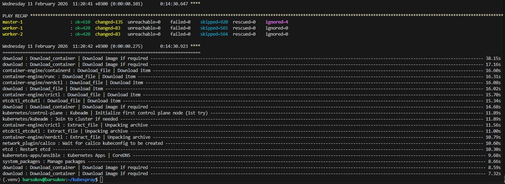 


Создаем конфигурационный файл `~/.kube/config` кластера Kubernetes на мастер-ноде:  
```bash  
  mkdir -p $HOME/.kube  
  cp -i /etc/kubernetes/admin.conf $HOME/.kube/config  
  chown $(id -u):$(id -g) $HOME/.kube/config  
``` 


Результаты выполнение:
Поды:
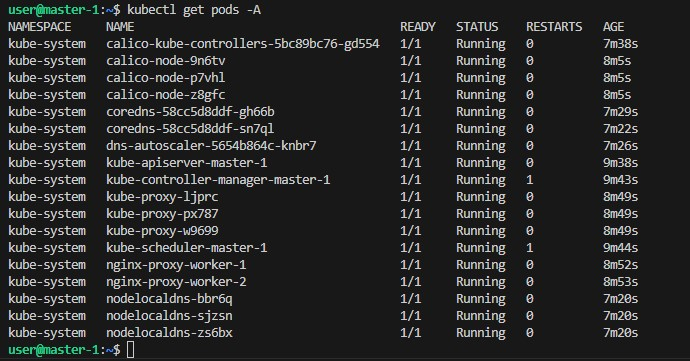 
Ноды
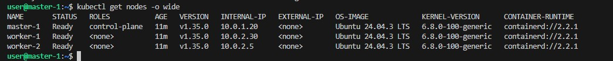 

---

### Создание тестового приложения

Для перехода к следующему этапу необходимо подготовить тестовое приложение, эмулирующее основное приложение разрабатываемое вашей компанией.

Способ подготовки:

1. Рекомендуемый вариант:  
   а. Создайте отдельный git репозиторий с простым nginx конфигом, который будет отдавать статические данные.  
   б. Подготовьте Dockerfile для создания образа приложения.  
2. Альтернативный вариант:  
   а. Используйте любой другой код, главное, чтобы был самостоятельно создан Dockerfile.

Ожидаемый результат:

1. Git репозиторий с тестовым приложением и Dockerfile.
2. Регистри с собранным docker image. В качестве регистри может быть DockerHub или [Yandex Container Registry](https://cloud.yandex.ru/services/container-registry), созданный также с помощью terraform.

---

### Решение. Создание тестового приложения.  


Подготовим тестовое приложение.

Созададим отдельный git репозиторий `Test-application-1` с простым nginx конфигом, который будет отдавать статические данные:

Клонируем репозиторий:
```bash
git clone https://github.com/Barsukov-Alex/Test-application-1.git
```

Создадим в этом репозитории файл содержащую HTML-код ниже:  
index.html
```html
<html>
<head>
Hey, Netology
</head>
<body>
<h1>Я студент «Нетологии», осваиваю профессию DevOps‑инженера</h1>
</body>
</html>
```

Создадим Dockerfile, который будет запускать веб-сервер Nginx в фоне с индекс страницей:  
Dockerfile
```Dockerfile
FROM nginx:1.27-alpine

COPY index.html /usr/share/nginx/html
```

Загрузим файлы в [Git-репозиторий](https://github.com/Barsukov-Alex/Test-application-1.git).


Выполним сборку приложения:

<details>
	<summary></summary>
      <br>

```bash
barsukov@barsukov:~/Test-application-1$ sudo docker build -t mozdoksity/nginx:v1 .
DEPRECATED: The legacy builder is deprecated and will be removed in a future release.
            Install the buildx component to build images with BuildKit:
            https://docs.docker.com/go/buildx/

Sending build context to Docker daemon  75.26kB
Step 1/2 : FROM nginx:1.27-alpine
1.27-alpine: Pulling from library/nginx
f18232174bc9: Pull complete 
61ca4f733c80: Pull complete 
b464cfdf2a63: Pull complete 
d7e507024086: Pull complete 
81bd8ed7ec67: Pull complete 
197eb75867ef: Pull complete 
34a64644b756: Pull complete 
39c2ddfd6010: Pull complete 
Digest: sha256:65645c7bb6a0661892a8b03b89d0743208a18dd2f3f17a54ef4b76fb8e2f2a10
Status: Downloaded newer image for nginx:1.27-alpine
 ---> 6769dc3a703c
Step 2/2 : COPY index.html /usr/share/nginx/html
 ---> c9c0a150cc97
Successfully built c9c0a150cc97
Successfully tagged mozdoksity/nginx:v1
barsukov@barsukov:~/Test-application-1$
``` 
</details>

Проверим, что образ создался:

```bash
barsukov@barsukov:~/Test-application-1$ sudo docker images
REPOSITORY         TAG           IMAGE ID       CREATED              SIZE
mozdoksity/nginx   v1            c9c0a150cc97   About a minute ago   48.2MB
nginx              1.27-alpine   6769dc3a703c   9 months ago         48.2MB
barsukov@barsukov:~/Test-application-1$ 
```

Запустим docker-контейнер с созданным образом и проверим его  работоспособность:

```bash
barsukov@barsukov:~/Test-application-1$ sudo docker run -d -p 80:80 mozdoksity/nginx:v1
c31e3749a62f534127e77f1b41ee55105fc73555ea9003944e614a6789fe3efb
barsukov@barsukov:~/Test-application-1$ sudo docker ps
CONTAINER ID   IMAGE                 COMMAND                  CREATED          STATUS          PORTS                               NAMES
c31e3749a62f   mozdoksity/nginx:v1   "/docker-entrypoint.…"   12 seconds ago   Up 11 seconds   0.0.0.0:80->80/tcp, :::80->80/tcp   quirky_pike
barsukov@barsukov:~/Test-application-1$ curl http://127.0.0.1
<html>
<head>
Hey, Netology
</head>
<body>
<h1>Я студент «Нетологии», осваиваю профессию DevOps инженера</h1>
</body>
</html>
barsukov@barsukov:~/Test-application-1$ 
```

Git репозиторий с тестовым приложением и Dockerfile [GITHub](https://github.com/Barsukov-Alex/Test-application-1.git)

Загрузим созданный образ в реестре [Docker Hub](https://hub.docker.com/repository/docker/mozdoksity/nginx/general):
```bash
barsukov@barsukov:~/Test-application-1$ sudo docker push mozdoksity/nginx:v1
The push refers to repository [docker.io/mozdoksity/nginx]
bfcb6188f85c: Pushed 
0d853d50b128: Mounted from library/nginx 
947e805a4ac7: Mounted from library/nginx 
811a4dbbf4a5: Mounted from library/nginx 
b8d7d1d22634: Mounted from library/nginx 
e244aa659f61: Mounted from library/nginx 
c56f134d3805: Mounted from library/nginx 
d71eae0084c1: Mounted from library/nginx 
08000c18d16d: Mounted from library/nginx 
v1: digest: sha256:b2431c5fa044cbb7b01bbeccf377656871af2dd30633e39eef273e62a28611ca size: 2196
barsukov@barsukov:~/Test-application-1$ 
```


---
### Подготовка cистемы мониторинга и деплой приложения

Уже должны быть готовы конфигурации для автоматического создания облачной инфраструктуры и поднятия Kubernetes кластера.  
Теперь необходимо подготовить конфигурационные файлы для настройки нашего Kubernetes кластера.

Цель:
1. Задеплоить в кластер [prometheus](https://prometheus.io/), [grafana](https://grafana.com/), [alertmanager](https://github.com/prometheus/alertmanager), [экспортер](https://github.com/prometheus/node_exporter) основных метрик Kubernetes.
2. Задеплоить тестовое приложение, например, [nginx](https://www.nginx.com/) сервер отдающий статическую страницу.

Способ выполнения:
1. Воспользоваться пакетом [kube-prometheus](https://github.com/prometheus-operator/kube-prometheus), который уже включает в себя [Kubernetes оператор](https://operatorhub.io/) для [grafana](https://grafana.com/), [prometheus](https://prometheus.io/), [alertmanager](https://github.com/prometheus/alertmanager) и [node_exporter](https://github.com/prometheus/node_exporter). Альтернативный вариант - использовать набор helm чартов от [bitnami](https://github.com/bitnami/charts/tree/main/bitnami).

---
### Решение.

Скопируем конфигурационный файл созданного kubernetes-кластера с мастер-ноды на нашу рабочую машину:  
```bash
  scp user@93.77.183.42:~/.kube/config ~/.kube/diplom-config
```  
Отредактируем в конфигурационном файле IP-адрес (с локального на публичный IP мастер-ноды):  
```bash
  nano ~/.kube/diplom-config  
```  
Применим новый конфигурационный файл для k8s:  
```bash
  export KUBECONFIG=~/.kube/diplom-config  
``` 
Проверяем
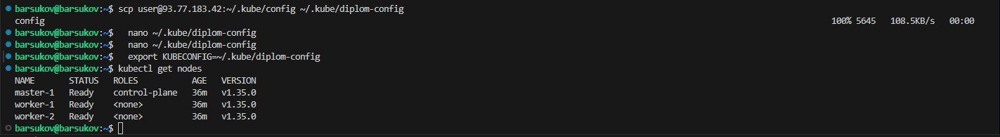 

Добавляем helm репозиторий:  
```bash  
  helm repo add prometheus-community https://prometheus-community.github.io/helm-charts
``` 
Сохраним значения по умолчанию Helm чарта prometheus-community в [файл](./k8s-configs/grafana-values.yaml) в директории `k8s-configs` и отредактируем его:
```bash  
  helm show values prometheus-community/kube-prometheus-stack > grafana-values.yaml
``` 
Изменяем пароль по умолчанию (значение для `adminPassword:`) для входа в Grafana, а также изменим сервис, присвоим ему порт 30050:  
```yml 
grafana:
  service:
    portName: http-web
    type: NodePort
    nodePort: 30070
```  
Выполняем установку prometheus-community:  
```bash  
helm upgrade --install monitoring prometheus-community/kube-prometheus-stack --create-namespace -n monitoring -f k8s-configs/grafana-values.yaml
``` 
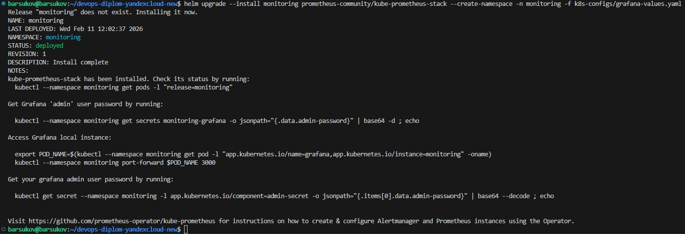 

После установки, проверяем поды в namespace monitoting:  
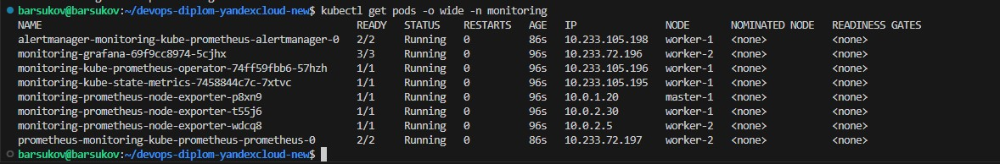   
Проверяем ноды в namespace monitoting:
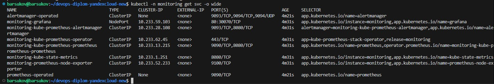  

Проверяем web-интерфейс Grafana и проходим авторизацию с заранее заданным в grafana-values.yaml паролем: 
http://93.77.183.42:30070
login: admin
passw: netology

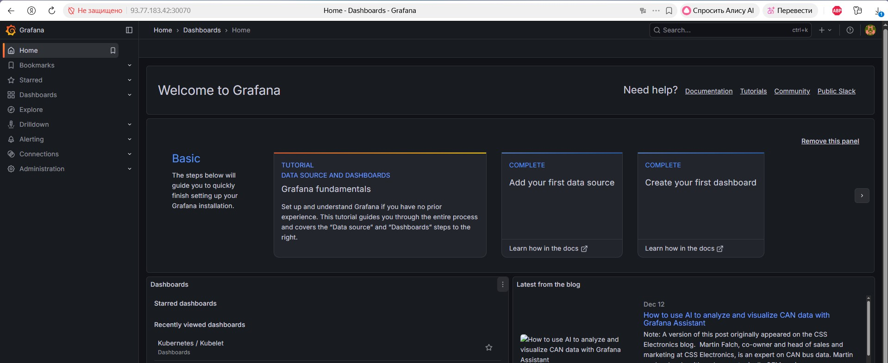  

Авторизация проходит успешно, данные о состоянии кластера отображаются на дашбордах:  
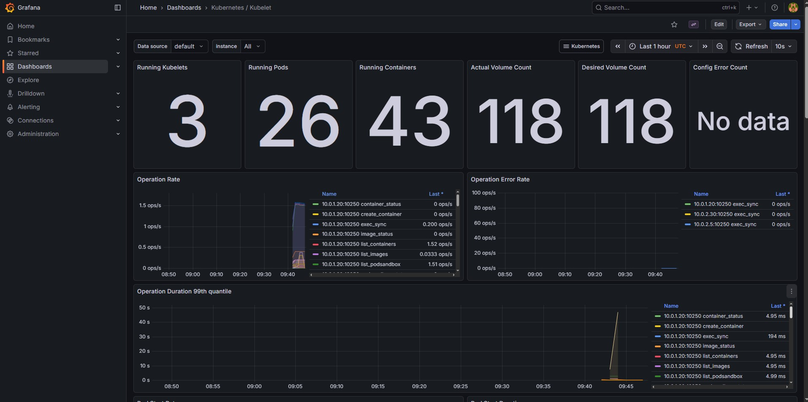   
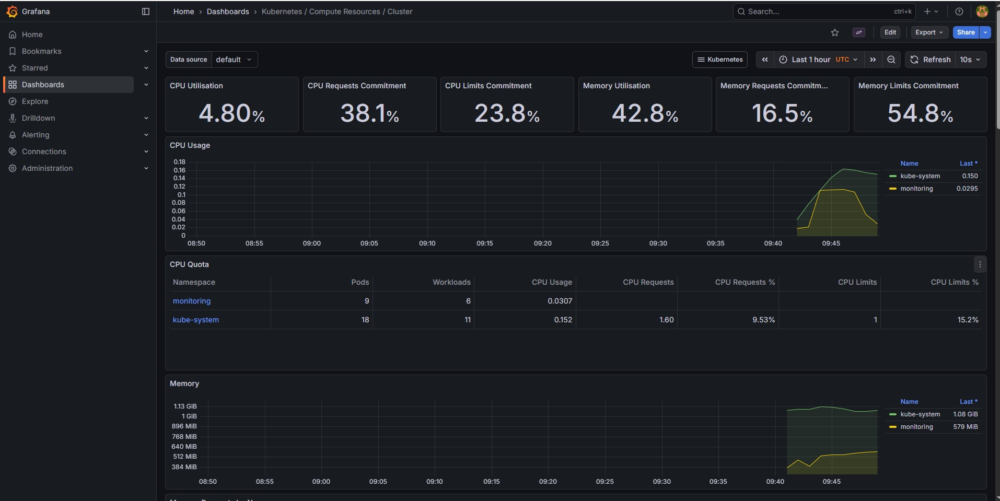 


Развёртывание системы мониторинга успешно завершено. 


Далее развёртываем наше тестовое приложение на Kubernetes кластере.  
Создаем отдельный namespace, в котором будем развёртывать тестовое приложение:  
```bash  
  kubectl create namespace test-application-1
``` 
Пишем [манифест](./k8s-configs/deployment-app.yaml) Deployment с тестовым приложением.  
Применяем манифест Deployment и проверяем результат:  
```bash  
  kubectl apply -f deployment-app.yaml -n test-application-1 
```  
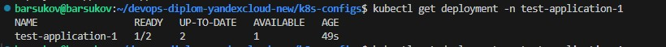  

Пишем [манифест](./k8s-configs/service-app.yaml) сервиса с типом NodePort для доступа к web-интерфейсу тестового приложения:  
Применяем манифест сервиса и проверяем результат:
```bash  
  kubectl apply -f service-app.yaml -n test-application-1
``` 
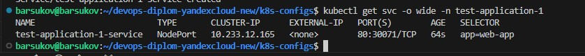   


Сервис создан. 
Проверяем доступ к приложению по публичному IP:  
http://93.77.183.42:30071/
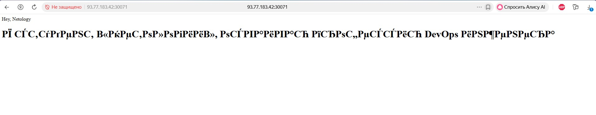 


Так как у нас несколько реплик приложения, создадим [балансировщик нагрузки](./terraform/backend/load-balancer.tf).  
Выполняем код `load-balancer.tf` командой `terraform apply`:  
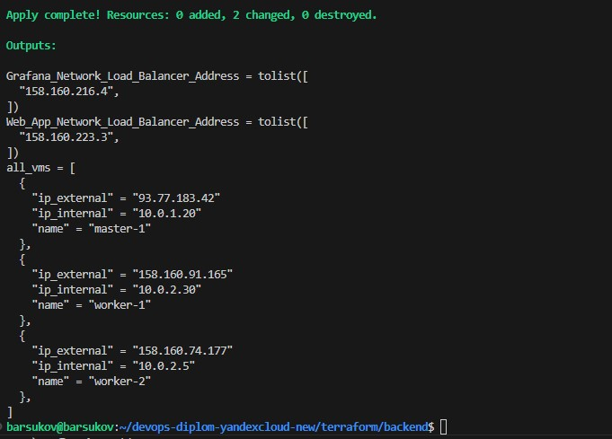 


Проверяем работу балансировщика нагрузки. 
Тестовое приложение и Grafana открываются на порту 80:  

- Тестовое приложение: 
http://158.160.223.3/
  
http://158.160.216.4
- Grafana:
http://158.160.216.4  
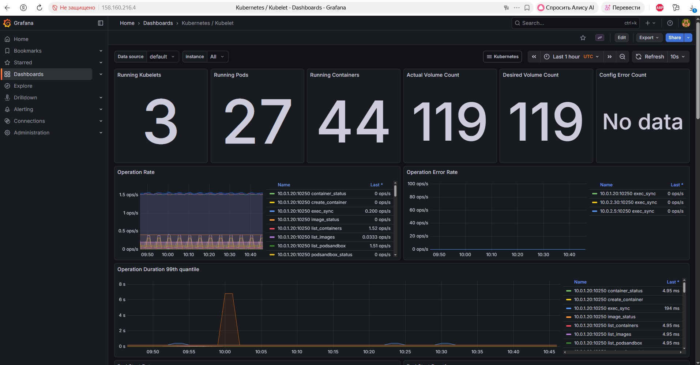 


---
### Деплой инфраструктуры в terraform pipeline

1. Если на первом этапе вы не воспользовались [Terraform Cloud](https://app.terraform.io/), то задеплойте и настройте в кластере [atlantis](https://www.runatlantis.io/) для отслеживания изменений инфраструктуры. Альтернативный вариант 3 задания: вместо Terraform Cloud или atlantis настройте на автоматический запуск и применение конфигурации terraform из вашего git-репозитория в выбранной вами CI-CD системе при любом комите в main ветку. Предоставьте скриншоты работы пайплайна из CI/CD системы.

Ожидаемый результат:
1. Git репозиторий с конфигурационными файлами для настройки Kubernetes.
2. Http доступ на 80 порту к web интерфейсу grafana.
3. Дашборды в grafana отображающие состояние Kubernetes кластера.
4. Http доступ на 80 порту к тестовому приложению.
5. Atlantis или terraform cloud или ci/cd-terraform
---

### Решение. Деплой инфраструктуры в terraform pipeline. 


Настраиваем автоматическое развертывание инфраструктуры terraform через Github Action.  
- Cоздаем директорию .github/workflows/ и в ней два файла:  
[terraform-bucket.yml](./.github/workflows/terraform-bucket.yml) - для развертывания бакета и сервисного аккаунта,  
[terraform-backend.yml](./.github/workflows/terraform-backend.yml) - для развертывания VPS, сети, подсети и прочей инфраструктуры. 
- Добавляем секретные данные, которые будут передаваться при исполнении манифестов:  
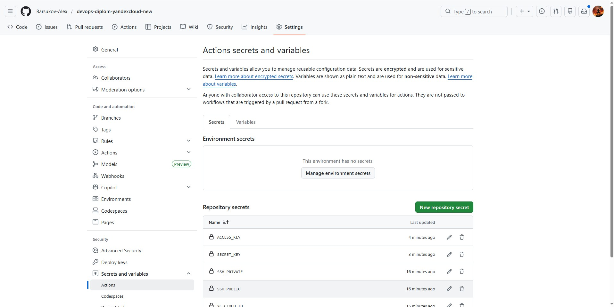   
- Манифест выполняется при ручном запуске, а также при git push кода Terraform в main ветку репозитория.  
- Результат выполнения манифестов:  
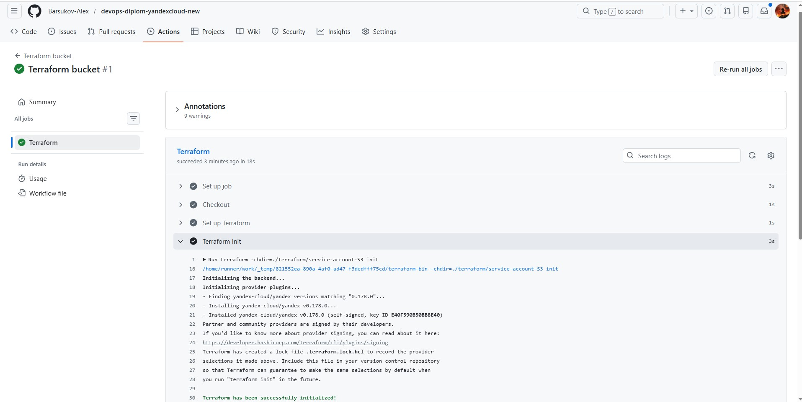 


---

### Установка и настройка CI/CD

Осталось настроить ci/cd систему для автоматической сборки docker image и деплоя приложения при изменении кода.

Цель:

1. Автоматическая сборка docker образа при коммите в репозиторий с тестовым приложением.
2. Автоматический деплой нового docker образа.

Можно использовать [teamcity](https://www.jetbrains.com/ru-ru/teamcity/), [jenkins](https://www.jenkins.io/), [GitLab CI](https://about.gitlab.com/stages-devops-lifecycle/continuous-integration/) или GitHub Actions.

Ожидаемый результат:

1. Интерфейс ci/cd сервиса доступен по http.
2. При любом коммите в репозиторие с тестовым приложением происходит сборка и отправка в регистр Docker образа.
3. При создании тега (например, v1.0.0) происходит сборка и отправка с соответствующим label в регистри, а также деплой соответствующего Docker образа в кластер Kubernetes.


---
### Решение. Установка и настройка CI/CD  
Настраиваем ci/cd систему для автоматической сборки docker image и деплоя приложения при изменении кода с помощью **GitHub Actions**.  
Для этого в [репозитории приложения](https://github.com/Barsukov-Alex/Test-application-1.git) создаем файл [ci-cd.yml](https://github.com/Barsukov-Alex/Test-application-1/blob/main/.github/workflows/ci-cd.yaml).  
Добавляем в secrets на GitHub данные для DockerHub и Kubernetes-кластера.  
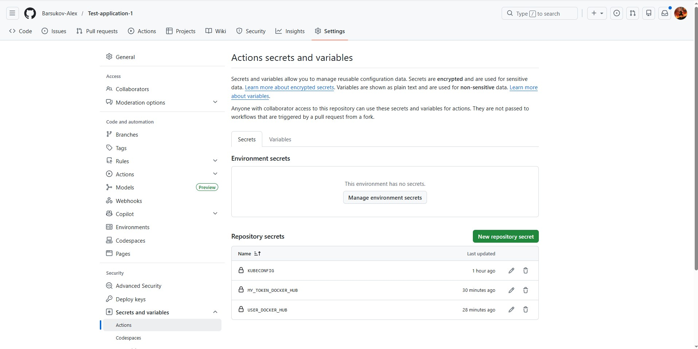   
Редактируем index.html и пишем в коммите комментарий v1.0.1 и отправляем в ветку main в github:  
   

Проверяем образы на DockerHub. Новый образ с новым tag добавился в DockerHub:  
   
[Web-страница](http://158.160.191.86/) обновилась. 
  
Автоматическая сборка docker-image с новым тегом  и деплой приложения в кластер прошли успешно.  

---


---
## Что необходимо для сдачи задания?

1. Репозиторий с конфигурационными файлами Terraform и готовность продемонстрировать создание всех ресурсов с нуля.
2. Пример pull request с комментариями созданными atlantis'ом или снимки экрана из Terraform Cloud или вашего CI-CD-terraform pipeline.
3. Репозиторий с конфигурацией ansible, если был выбран способ создания Kubernetes кластера при помощи ansible.
4. Репозиторий с Dockerfile тестового приложения и ссылка на собранный docker image.
5. Репозиторий с конфигурацией Kubernetes кластера.
6. Ссылка на тестовое приложение и веб интерфейс Grafana с данными доступа.
7. Все репозитории рекомендуется хранить на одном ресурсе (github, gitlab)

